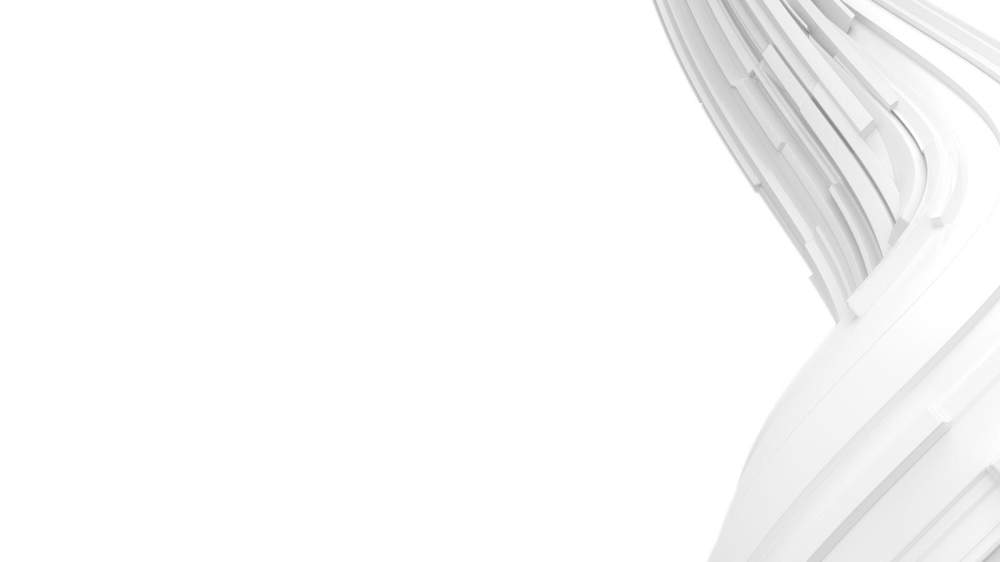

<!--
  The fixture behind tests/test_pptx_components.py. One slide per archetype,
  in the order the test asserts. Add a slide here and add its expectations
  there in the same commit.
-->

# A section divider {background-image="../assets/swirl-dark.jpg" background-color="#000000"}

## Kicker

### Bullets and chips share a slide

- First bullet
- Second bullet

[Non-legislative]{.chip} [Highlight]{.chip .accent}

## By the numbers

### Four figures and a takeaway

::: {.stats}

::: {.stat}
[82 M€]{.figure} [Cost saved]{.label}
:::

::: {.stat}
[16]{.figure} [Countries]{.label}
:::

::: {.stat}
[2 450]{.figure} [Employees]{.label}
:::

::: {.stat}
[~6 wks]{.figure} [Time to value]{.label}
:::

:::

::: {.takeaway}
Every figure on this slide is **sourced** below.
:::

::: {.source}
[Source:]{.label} Nexer Group annual report 2025
:::

## Evidence

### A chart on the left and the argument on the right

::::: {.columns}

:::: {.column width="55%"}

::: {.units}
Index, 2021 = 12
:::

::::

:::: {.column width="45%"}

#### Key drivers

- Tooling became cheap enough to trial
- Procurement cycles shortened

::: {.takeaway}
The gap is a **distribution** problem.
:::

::::

:::::

::: {.source}
[Source:]{.label} Internal benchmark
:::

## Full width

### One exhibit fills the slide

::: {.units}
€ millions, annualised
:::

::: {.source}
[Note:]{.label} Rounded. &nbsp; [Source:]{.label} Engagement model v4
:::

## Options

### A table keeps its rail on the same slide

| Route | Risk sits with | Time to value |
|---|---|---|
| Pilot first | Nexer | ~6 weeks |
| Buy and adapt | Client | ~3 months |

::: {.source}
[Source:]{.label} Engagement model v4
:::

## Context {background-color="#5A1F9F"}

### Statement slides carry one sentence and nothing else

## Framing

### Text before an exhibit still picks Content with Caption

A sentence of framing text before the exhibit.

##
